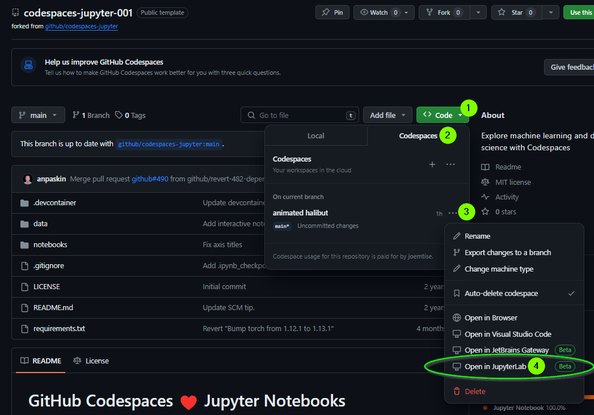

# GitHub Codespaces ♥️ Jupyter Notebooks

Welcome! Open this repo in JupyterLab inside a Github codespace to get started.

Everything you do inside your codespace is saved, until the codespace is disposed (~10 days since last use).

You can "Push" your changes to Github to share with colleagues or to save more permanently.

